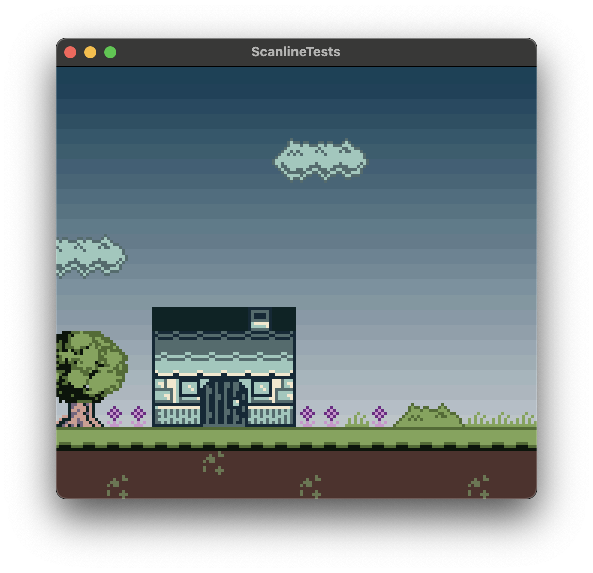

# Background Gradient FX Plugin for GB Studio

An experimental GB Studio plugin that creates a gradient effect for scene backgrounds.

> [!WARNING] 
> This plugin isn’t compatible with other features that use scanline interrupts. Features such as background text drawing, dialogue rendering on top, parallax scrolling, or Logo scenes may not work as expected across **the entire project** and not just in scenes where Background Gradient FX is enabled. Other plugins that rely on scanline interrupts are also unlikely to work properly.

# How to Use

> [!Note] 
> This plugin has only been tested with the [develop](https://github.com/chrismaltby/gb-studio/tree/develop) branch of GB Studio. It should work in older versions but it might display a warning at compile time.

- Copy the `Background Gradient FX` folder into your project's `plugin` folder.

- Use the `Init Background Gradient FX Colors` event to set the gradient’s start and end colors.
- Use the `Enable Background Gradient FX` event to activate the effect. 
- By default, the plugin replaces the first color of Background Palettes 1–4 with the gradient color. You can change which palettes are replaced in the `Gradient FX` section of the Project Settings page.
- Use the Disable `Background Gradient FX` event to turn the effect off.

Inspired by the excellent Scanline FX plugin template by [Gud Graphics](https://github.com/mikeleisz/gud_gbs_plugins) 

